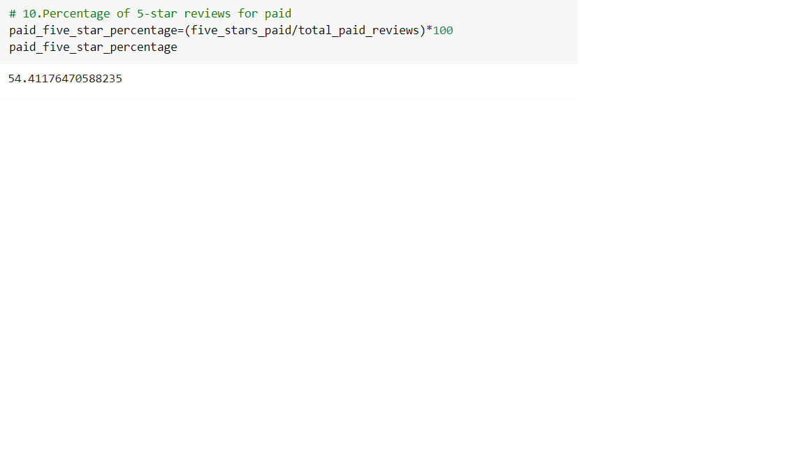
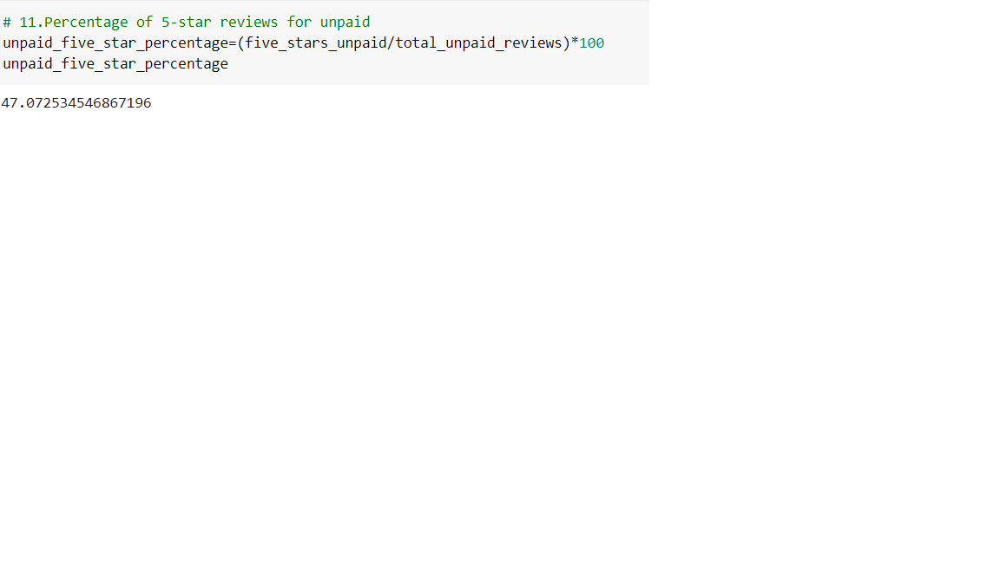

# Amazon_Vine_Analysis

## Overview of the Analysis

This project uses a databse that shows Amazon reviews on furniture. The purpose of the project is to determine if there is any bias toward favorable reviews from Vine members in the dataset.The Amazon Vine program is a service that allows manufacturers and publishers to receive reviews for their products. 
 
This analysis uses different technologies such as GoogleColab to provide a remote workspace, Amazon Web Services(AWS) to store relational databses and PySpark to perform the ETL process and analyze the information.

## Results

For this anlysis we considered Vine reviews as the paid members and Non vine reviews and unpaid members

How many Vine reviews and non-Vine reviews were there?

Vine reviews: 136

Non vine reviews:18,019

How many Vine reviews  and non-Vine reviews were 5 stars? 

Vine reviews: 74

Non vine reviews:8,482

What percentage of Vine reviews  and non-Vine reviews were 5 stars? 

Vine reviews

Non-Vine Reviews

## Summary 
From the previous results we can conclude that there is in fact a positivity bias for reviews in the Vine program. The percentage of five stars for non vine members is around 47% while the percentage of five stars for Vine members is 54%. This shows a difference of 7% between non and vine members.

An additional analysis that can be done in order to better understand the dataset and see if this finding is true, could be to run the same anlysis but this time considereing only verified purchases. Another analysis that could help to support the statment that vine members have better reviews compared to non vine mebers can be to analyze a different dataset and see if this behaviour prevails for other products, or if it is somthing extriclty to furniture. 

